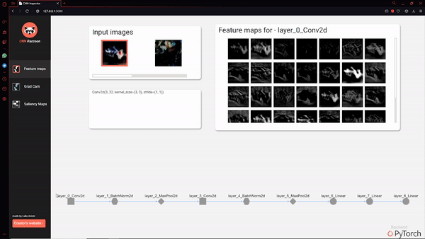
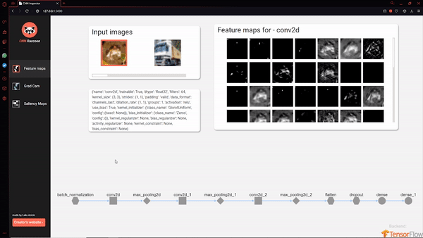
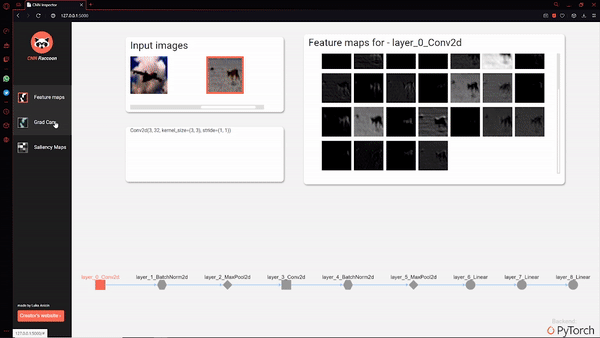
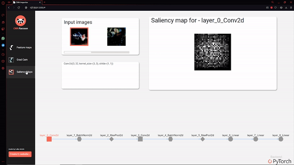

<link rel="stylesheet" type="text/css" media="all" href="images/readme.css" />

# CNN Raccoon v0.9.5

<p align="center">
  
</p>

[](https://pepy.tech/project/cnn-raccoon)
   
<h4 style="text-align: center;">Create interactive dashboards for your Convolutional Neural Networks (CNNs) with a single line of code!</h4>

---
__CNN Raccoon__ helps you with inspecting what's going on inside your Convolutional Neural Networks in a visual way that's easy to understand.
Oh! Did I mention that you don't need to change your code at all? And that you can do all of this on a single line of Python code?


## How to use it?

### TensorFlow mode

When using CNN Raccoon for a TensorFlow (Keras) based model, you'll implement your model in the same way as before. 
To load images from your dataset into CNN Raccoon, convert them to `np.array` object.
Check an example below for the `CIFAR10` dataset. 

```python
model = tf.keras.models.Sequential([ ... ])
model.compile(...)
# You define and compile model in the same way

# Let's use Cifar-10 for this example, but can be any dataset
from tensorflow.keras.datasets import cifar10

(X_train, y_train), (X_test, y_test) = cifar10.load_data()

# CNN Raccoon magic!
from cnn_raccoon import inspector

# In a single line of code send your model to the Inspector
inspector(model=model, images=X_train[:10], number_of_classes=10, engine="keras")
```

### PyTorch mode

If you decide to use CNN Raccoon for your PyTorch model, you'll implement your model in the same way as before. 
To load images from your dataset into CNN Raccoon, convert them to the `PyTorch.Variable` object.
The best way to achieve this is by using PyTorch's dataset loader.
Check an example below for the `CIFAR10` dataset. 

```python
# For PyTorch you define the model in the same way as before
model = Net()

# Load dataset using data loaders
transform = transforms.Compose(
    [ transforms.ToTensor(),
     transforms.Normalize((0.5, 0.5, 0.5), (0.5, 0.5, 0.5))])

trainset = torchvision.datasets.CIFAR10(root='./data', train=True,
                                        download=True, transform=transform)
trainloader = torch.utils.data.DataLoader(trainset, batch_size=4,
                                          shuffle=True, num_workers=2)
dataiter = iter(trainloader)
images, labels = dataiter.next()

# CNN Raccoon magic!
from cnn_raccoon import inspector

# In a single line of code send your model to the Inspector
inspector(model=model, images=images, number_of_classes=10, engine="keras")
```


### Interactive network graph

This library generates an interactive graph of your CNN directly in a browser. This graph allows you to click and inspect each layer inside your model.



### Weights inspector

Visualization of each Convolutional filter from your network




### GradCam

Based on the paper [Grad-CAM: Visual Explanations from Deep Networks
via Gradient-based Localization
](https://arxiv.org/pdf/1610.02391.pdf).

To learn more about GradCam and Class Activation maps I do suggest reading through [this post](https://towardsdatascience.com/interpretability-in-deep-learning-with-w-b-cam-and-gradcam-45ba5296a58a). 




### Siliency Maps

Based on the paper [Deep Inside Convolutional Networks: Visualising
Image Classification Models and Saliency Maps
](https://arxiv.org/pdf/1312.6034.pdf).

To learn more about Saliency Maps I do suggest reading through [this post](https://analyticsindiamag.com/what-are-saliency-maps-in-deep-learning/). 





## Installation

### Installation with `pip`

You can install CNN Raccoon directly from the PyPi repository using `pip` (or `pip3`): 

```bash
pip install cnn-raccoon
```

### Manual installation

If you prefer to install it from source:

1. Clone this repository

```bash
git clone https://github.com/lucko515/cnn-raccoon
```

2. Go to the library folder and run

```bash
pip install .
```

### Requirements

#### PyTorch version 

Install all requirements from `requirements.txt` file

`pip install -r requirements.txt`

After installing base, requirements make sure you have PyTorch `>1.5.0` version.
Here is the PyTorch installation guide:
https://pytorch.org/get-started/locally/

#### TensorFlow version

Install all requirements from `requirements.txt` file

`pip install -r requirements.txt`

After installing base, requirements make sure you have TensorFlow (w/ Keras API) `>2.0.0` version.
Here is the TensorFlow (w/ Keras API) installation guide:
https://www.tensorflow.org/install

## TODO

If you want to contribute to the CNN Raccoon, here is what's on the TODO list:

- [ ] Silency Map for the __TensorFlow__ mode
- [ ] Make dashboard responsive on smaller screens (< 1100px)
- [ ] Interactive CNN Builder
    - [ ] Drag n Drop network builder

## Contact

Add me on [LinkedIn](https://www.linkedin.com/in/luka-anicin/)